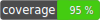

# Tinkoff Invest V1 instruments service get dividends method



Wrapper over the method for receiving dividend payment events for an instrument.

Provides a set of functions to receive dividends for a different set of query parameters.

Tinkoff swagger difinition https://tinkoff.github.io/investAPI/swagger-ui/#/InstrumentsService/InstrumentsService_GetDividends

## Component content

The component consists of two basic parts:
- *rocketfellows\TinkoffInvestV1MethodGetDividends\DividendsService* - direct destination service to get list of dividends for an instrument
- *adapters* - adapters that implement a way to receive dividends for an instrument

## DividendsService

*DividendsService* - service provides functions for requesting a list of instrument dividends.

List of functions and their contract:
- *getAll* - takes figi value of the instrument as an input parameter, returns *Dividends* tuple, throws *SourceFaultException* and *IncorrectInputsException*
- *getBeforeDate* - as input parameters, it takes figi value of the instrument and the date of fixing the register (record_date) up to which, inclusive, it is necessary to carry out the search, returns *Dividends* tuple, throws *SourceFaultException* and *IncorrectInputsException*
- *getByPeriod* - as input parameters, it takes figi value of the instrument and the range of registry fixing dates in the interval of which it is necessary to search, returns *Dividends* tuple, throws *SourceFaultException* and *IncorrectInputsException*

```php
/**
 * @throws SourceFaultException
 * @throws IncorrectInputsException
 */
public function getAll(string $figi): Dividends;

/**
 * @throws SourceFaultException
 * @throws IncorrectInputsException
 */
public function getBeforeDate(string $figi, DateTime $dateTime): Dividends;

/**
 * @throws IncorrectInputsException
 * @throws SourceFaultException
 */
public function getByPeriod(string $figi, DateTime $fromDateTime, DateTime $toDateTime): Dividends;
```

*Figi* - instrument identifier.

*Dividends* - definition - *rocketfellows\TinkoffInvestV1MethodGetDividends\models\Dividends*, an immutable tuple of *Dividend* type objects.

*Dividend* - definition - *rocketfellows\TinkoffInvestV1MethodGetDividends\models\Dividend*, describes the dividend data of the instrument, scheme definition here https://tinkoff.github.io/investAPI/swagger-ui/#/InstrumentsService/InstrumentsService_GetDividends

*DividendsServiceException* - definition - *rocketfellows\TinkoffInvestV1MethodGetDividends\exceptions\DividendsServiceException*, the base exception abstract class of this component.

*IncorrectInputsException* - definition - *rocketfellows\TinkoffInvestV1MethodGetDividends\exceptions\IncorrectInputsException*, the exception thrown if the input data for searching for instrument dividends was incorrect, for example searching by figi for a non-existent instrument.

*SourceFaultException* - definition - *rocketfellows\TinkoffInvestV1MethodGetDividends\exceptions\SourceFaultException*, exception thrown if an error has occurred on the server side of the api tinkoff investment.

*DividendsRequestInterface* - definition - *rocketfellows\TinkoffInvestV1MethodGetDividends\DividendsRequestInterface*, the interface with which the *DividendsService* service works to receive data on instrument dividends from various sources. An interface must be implemented by an adapter, such as an adapter for rest, soap, gRpc, etc.

```php
/**
* @throws IncorrectInputsException
* @throws SourceFaultException
*/
public function requestAll(string $figi): Dividends;

/**
* @throws IncorrectInputsException
* @throws SourceFaultException
*/
public function requestToDate(string $figi, DateTime $toDateTime): Dividends;

/**
* @throws IncorrectInputsException
* @throws SourceFaultException
*/
public function requestByPeriod(string $figi, DateTime $fromDateTime, DateTime $toDateTime): Dividends;
```

## Adapters

So far, the REST API described in the swagger file at https://tinkoff.github.io/investAPI/swagger-ui/#/InstrumentsService/InstrumentsService_GetDividends serves as a source for obtaining information about instrument dividend payments.
Therefore, within the framework of this component, a REST API adapter to the *rocketfellows\TinkoffInvestV1MethodGetDividends\DividendsRequestInterface* interface is implemented.

Feel free to implement other adapters to get dividend data.

So far list of implemented adapters:
- REST

## REST adapter

An REST API adapter class that implements the interface *rocketfellows\TinkoffInvestV1MethodGetDividends\DividendsRequestInterface* - *rocketfellows\TinkoffInvestV1MethodGetDividends\adapters\rest\DividendsRequestService*

All contracts of interface implemented in this class, inputs, outputs, exceptions.

The adapter uses as dependency a low-level abstraction to get data on dividends *rocketfellows\TinkoffInvestV1InstrumentsRestClient\GetDividendsInterface* - an interface provided in the *rocketfellows/tinkoff-invest-v1-instruments-rest-client* component,
link to the component https://github.com/rocketfellows/tinkoff-invest -v1-instruments-rest-client

## REST API adapter usage examples

In order to start using the service for receiving data on dividend payments, you need to configure the following:
- low-level REST API client *rocketfellows\TinkoffInvestV1RestClient\Client*
- define an implementation of the interface *rocketfellows\TinkoffInvestV1InstrumentsRestClient\GetDividendsInterface*
- pass an implementation of the interface *rocketfellows\TinkoffInvestV1InstrumentsRestClient\GetDividendsInterface* as a dependency to *rocketfellows\TinkoffInvestV1MethodGetDividends\adapters\rest\DividendsRequestService*
- pass as a dependency to *rocketfellows\TinkoffInvestV1MethodGetDividends\DividendsService* the implementation of the *rocketfellows\TinkoffInvestV1MethodGetDividends\DividendsRequestInterface* interface - in this example, it will be the REST API implementation of the *rocketfellows\TinkoffInvestV1MethodGetDividends\adapters\rest\DividendsRequestService* adapter

Of course, you can make all these preliminary settings through your DI container.

Configuration example:
```php
$client = new \rocketfellows\TinkoffInvestV1RestClient\Client(
    (
        new \rocketfellows\TinkoffInvestV1RestClient\ClientConfig(
            'https://invest-public-api.tinkoff.ru/rest',
            <your_access_token>
        )
    ),
    new \GuzzleHttp\Client()
);

$instrumentsService = new \rocketfellows\TinkoffInvestV1InstrumentsRestClient\InstrumentsService($client);

$dividendsRequestService = new \rocketfellows\TinkoffInvestV1MethodGetDividends\adapters\rest\DividendsRequestService($instrumentsService);

```

Service functions call example:

```php
$dividends = $dividendsService->getByPeriod(
    'BBG004730RP0',
    new DateTime('2022-05-24T15:38:52.283Z'),
    new DateTime('2022-08-24T15:38:52.283Z'),
);

var_dump($dividends);

```

Output:

```php
object(rocketfellows\TinkoffInvestV1MethodGetDividends\models\Dividends)#35 (2) {
  ["data":protected]=>
  array(1) {
    [0]=>
    object(rocketfellows\TinkoffInvestV1MethodGetDividends\models\Dividend)#38 (10) {
      ["dividendNet":"rocketfellows\TinkoffInvestV1MethodGetDividends\models\Dividend":private]=>
      object(rocketfellows\TinkoffInvestV1Common\models\MoneyValue)#36 (3) {
        ["currency":"rocketfellows\TinkoffInvestV1Common\models\MoneyValue":private]=>
        object(arslanimamutdinov\ISOStandard4217\Currency)#23 (3) {
          ["name":"arslanimamutdinov\ISOStandard4217\Currency":private]=>
          string(13) "Russian ruble"
          ["alpha3":"arslanimamutdinov\ISOStandard4217\Currency":private]=>
          string(3) "RUB"
          ["numericCode":"arslanimamutdinov\ISOStandard4217\Currency":private]=>
          string(3) "643"
        }
        ["units":"rocketfellows\TinkoffInvestV1Common\models\MoneyValue":private]=>
        int(52)
        ["nano":"rocketfellows\TinkoffInvestV1Common\models\MoneyValue":private]=>
        int(530000000)
      }
      ["closePrice":"rocketfellows\TinkoffInvestV1MethodGetDividends\models\Dividend":private]=>
      object(rocketfellows\TinkoffInvestV1Common\models\MoneyValue)#33 (3) {
        ["currency":"rocketfellows\TinkoffInvestV1Common\models\MoneyValue":private]=>
        object(arslanimamutdinov\ISOStandard4217\Currency)#26 (3) {
          ["name":"arslanimamutdinov\ISOStandard4217\Currency":private]=>
          string(13) "Russian ruble"
          ["alpha3":"arslanimamutdinov\ISOStandard4217\Currency":private]=>
          string(3) "RUB"
          ["numericCode":"arslanimamutdinov\ISOStandard4217\Currency":private]=>
          string(3) "643"
        }
        ["units":"rocketfellows\TinkoffInvestV1Common\models\MoneyValue":private]=>
        int(296)
        ["nano":"rocketfellows\TinkoffInvestV1Common\models\MoneyValue":private]=>
        int(0)
      }
      ["yieldValue":"rocketfellows\TinkoffInvestV1MethodGetDividends\models\Dividend":private]=>
      object(rocketfellows\TinkoffInvestV1Common\models\Quotation)#24 (2) {
        ["units":"rocketfellows\TinkoffInvestV1Common\models\Quotation":private]=>
        int(17)
        ["nano":"rocketfellows\TinkoffInvestV1Common\models\Quotation":private]=>
        int(750000000)
      }
      ["paymentDate":"rocketfellows\TinkoffInvestV1MethodGetDividends\models\Dividend":private]=>
      NULL
      ["declaredDate":"rocketfellows\TinkoffInvestV1MethodGetDividends\models\Dividend":private]=>
      object(DateTime)#22 (3) {
        ["date"]=>
        string(26) "2022-06-30 00:00:00.000000"
        ["timezone_type"]=>
        int(2)
        ["timezone"]=>
        string(1) "Z"
      }
      ["lastBuyDate":"rocketfellows\TinkoffInvestV1MethodGetDividends\models\Dividend":private]=>
      object(DateTime)#37 (3) {
        ["date"]=>
        string(26) "2022-07-18 00:00:00.000000"
        ["timezone_type"]=>
        int(2)
        ["timezone"]=>
        string(1) "Z"
      }
      ["recordDate":"rocketfellows\TinkoffInvestV1MethodGetDividends\models\Dividend":private]=>
      object(DateTime)#30 (3) {
        ["date"]=>
        string(26) "2022-07-20 00:00:00.000000"
        ["timezone_type"]=>
        int(2)
        ["timezone"]=>
        string(1) "Z"
      }
      ["createdAt":"rocketfellows\TinkoffInvestV1MethodGetDividends\models\Dividend":private]=>
      object(DateTime)#39 (3) {
        ["date"]=>
        string(26) "2022-06-26 02:04:44.658320"
        ["timezone_type"]=>
        int(2)
        ["timezone"]=>
        string(1) "Z"
      }
      ["dividendType":"rocketfellows\TinkoffInvestV1MethodGetDividends\models\Dividend":private]=>
      string(0) ""
      ["regularity":"rocketfellows\TinkoffInvestV1MethodGetDividends\models\Dividend":private]=>
      string(0) ""
    }
  }
  ["position"]=>
  int(0)
}
```

## Contributing

Welcome to pull requests. If there is a major changes, first please open an issue for discussion.

Please make sure to update tests as appropriate.